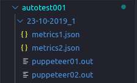
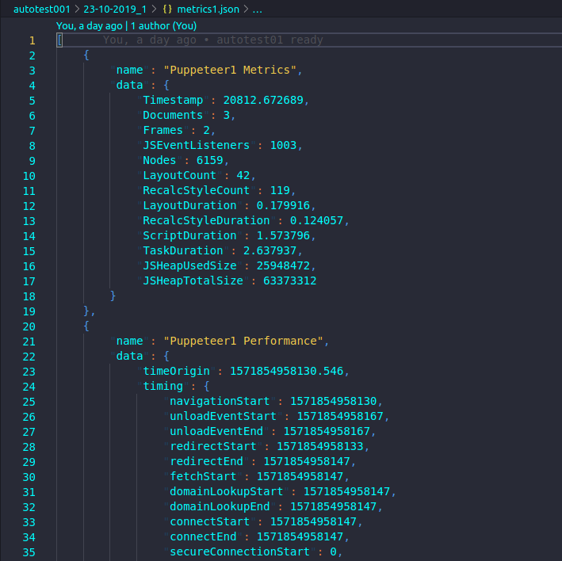

# autotest006

## About

This script is about Webcams testing and full screen Webcam.

## Details

This script runs 2 puppeteer instances and gets the Metrics and the Performance stats.

This script generates execution folder with the name `Date_ExecutionNum` (example: `data/01-01-2019_1`) inside autotest006 folder.

This script generates the log files `puppeteer01.out` and `puppeteer02.out` and the Metrics in `metrics1.json` and `metrics2.json` files.

## Running

To run, execute `./autotest006/run.sh *URL*`

or also running: 

```
cd autotest006
./run.sh
```

~~~bash
example: 

./autotest006/run.sh https://bbb-website.com
~~~

The default script will launch the clients it needs on the server you describe in the URL.

## Screenshots

The outputs of `puppeteer01.js` and `puppeteer02.js` will be displayed as in the picture below:


The metrics will show something like this:

